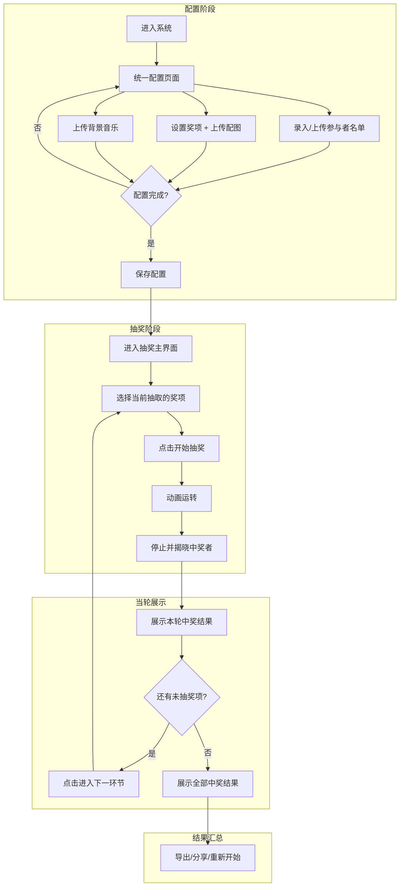
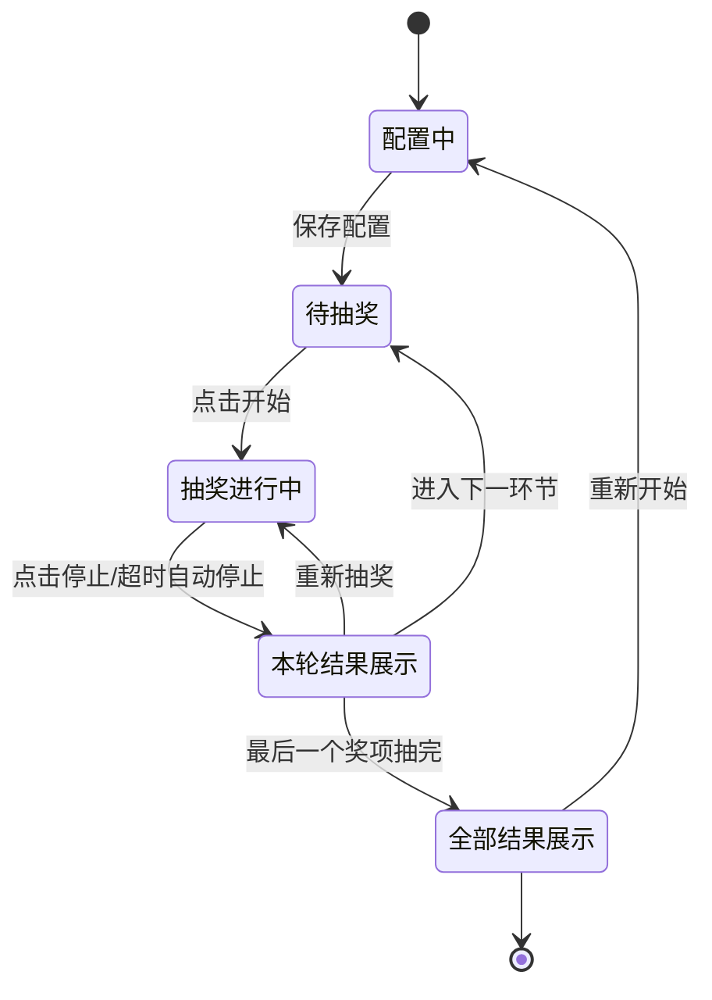

# 产品需求文档：赛博朋克抽奖系统 - V1.0

## 1. 综述 (Overview)

### 1.1 项目背景与核心问题

本项目旨在开发一个**酷炫的赛博朋克风格抽奖网站**，用于各类活动现场的抽奖环节。系统需要支持：
- 灵活配置参与者名单和奖项设置
- 多轮分奖项抽取
- 酷炫的视觉效果（思维网络 + 宇宙星球融合动画）
- 精美的中奖结果展示

**目标用户**：活动组织者（如社群活动、直播抽奖等场景）

### 1.2 核心业务流程 / 用户旅程地图

1. **阶段一：参与者配置** - 用户上传/录入参与抽奖的人员名单
2. **阶段二：奖项设置** - 用户自定义奖项类型、中奖人数、配图及抽取规则
3. **阶段三：氛围增强** - 用户上传背景音乐增强现场仪式感
4. **阶段四：抽奖执行** - 在赛博朋克界面上进行多轮抽奖
5. **阶段五：中奖展示** - 展示当轮及全部中奖结果

### 1.3 Mermaid 图

#### 1.3.1 用户操作流



#### 1.3.2 抽奖状态机



---

## 2. 用户故事详述 (User Stories)

### 阶段一：参与者配置

---

#### **US-01: 配置参与者名单**

* **价值陈述 (Value Statement)**:
    * **作为** 抽奖活动组织者
    * **我希望** 能够灵活地录入/管理参与抽奖的人员名单
    * **以便于** 后续进行抽奖

* **字段定义**:

| 字段 | 类型 | 必填 | 说明 |
|:---|:---|:---:|:---|
| 姓名 | 文本 | ✅ | 参与者姓名 |
| 备注 | 文本 | ❌ | 用户自定义标识（如公众号、部门等） |
| 头像 | 图片 | ❌ | 参与者头像，用于中奖展示 |

* **业务规则与逻辑 (Business Logic)**:

1. **录入方式**:
   - 手动逐条添加
   - 文本粘贴：支持微信接龙格式（`1. 张三`），自动解析姓名，备注留空
   - 文件上传：支持 Excel/CSV，提供**模板下载**

2. **编辑操作**:
   - 修改单个参与者信息
   - 删除单个参与者
   - 清空全部（需二次确认）

3. **数据校验**:
   - 最少1人才能保存配置
   - 检测到同名时，显示**弱提醒**（黄色提示条，非阻断）
   - 保存时，系统自动为同名且无备注者生成区分标识（如 `#1`、`#4`）

* **验收标准 (Acceptance Criteria)**:

| 场景 | GIVEN | WHEN | THEN |
|:---|:---|:---|:---|
| 手动添加 | 配置页面已打开 | 用户填写姓名并提交 | 成功添加，备注显示为 `-` |
| 文本粘贴 | 配置页面已打开 | 粘贴 `1. 张三\n2. 李四` | 自动解析出2人，备注为空 |
| 文件上传 | 配置页面已打开 | 上传符合模板的Excel | 成功导入所有参与者 |
| 重复姓名 | 已有"张三" | 再添加一个"张三" | 显示弱提醒；保存后自动生成 `#1`、`#2` |
| 空名单保存 | 名单为空 | 点击保存 | 阻止保存，提示"至少需要1名参与者" |
| 清空全部 | 名单有数据 | 点击清空 | 弹出二次确认，确认后清空 |

* **页面布局线框图 (ASCII Wireframe)**:

```text
┌─────────────────────────────────────────────────────────────────────┐
│                     ⚡ 参与者配置                                    │
├─────────────────────────────────────────────────────────────────────┤
│  📋 录入方式                                                         │
│  ┌─────────────┐ ┌─────────────┐ ┌─────────────────────────────┐    │
│  │ + 手动添加  │ │ 📄 粘贴文本 │ │ 📁 上传文件  [下载模板]     │    │
│  └─────────────┘ └─────────────┘ └─────────────────────────────┘    │
├─────────────────────────────────────────────────────────────────────┤
│  📊 参与者列表                                      共 25 人         │
│  ┌────┬────────┬──────────────┬──────────────────┬────────────┐     │
│  │ #  │ 头像   │ 姓名         │ 备注（选填）     │ 操作       │     │
│  ├────┼────────┼──────────────┼──────────────────┼────────────┤     │
│  │ 1  │ [IMG]  │ 张三         │ 公众号A          │ [编辑][删] │     │
│  │ 2  │ [IMG]  │ 李四         │ -                │ [编辑][删] │     │
│  │ 3  │ [IMG]  │ 王五         │ 公众号B          │ [编辑][删] │     │
│  └────┴────────┴──────────────┴──────────────────┴────────────┘     │
│  ┌─────────────┐                                                    │
│  │ 🗑️ 清空全部  │                                                    │
│  └─────────────┘                                                    │
└─────────────────────────────────────────────────────────────────────┘
```

---

### 阶段二：奖项设置

---

#### **US-02: 设置奖项（含配图上传）**

* **价值陈述 (Value Statement)**:
    * **作为** 抽奖活动组织者
    * **我希望** 能够自定义各种奖项及其配图和抽取规则
    * **以便于** 灵活配置抽奖内容

* **字段定义**:

| 字段 | 类型 | 必填 | 说明 |
|:---|:---|:---:|:---|
| 奖项名称 | 文本 | ✅ | 如"特等奖"，**不允许重复** |
| 中奖人数 | 数字 | ✅ | 该奖项抽取几人（≥1） |
| 奖项描述 | 文本 | ✅ | 详细描述奖品内容 |
| 奖项配图 | 图片 | ❌ | 用户上传，不传则用系统默认图标 |
| 抽取方式 | 选项 | ✅ | 一次抽出全部 / 逐个抽取（默认：一次抽出全部） |
| 排除规则 | 选项 | ✅ | 排除已中奖者 / 全员可参与（默认：排除已中奖者） |

* **业务规则与逻辑 (Business Logic)**:

1. **奖项管理**:
   - 添加奖项（弹窗形式）
   - 编辑已有奖项
   - 删除奖项
   - **拖拽排序**：自由调整抽奖顺序

2. **配图处理**:
   - 支持上传图片作为奖项配图
   - 未上传时，使用系统默认卡通图标（根据奖项等级匹配：皇冠/奖杯/奖牌/礼盒等）

3. **数据校验**:
   - 奖项名称**唯一**，重复则阻止保存
   - 中奖人数总和 **≤ 参与者总人数**，超出则阻止保存并提示

4. **弹窗交互**:
   - `[取消]` `[保存]` 固定在弹窗右上角
   - 表单内容超过一定高度时可滚动

* **验收标准 (Acceptance Criteria)**:

| 场景 | GIVEN | WHEN | THEN |
|:---|:---|:---|:---|
| 添加无配图奖项 | 弹窗已打开 | 填写必填项，不上传图 | 成功添加，显示默认图标 |
| 添加有配图奖项 | 弹窗已打开 | 填写必填项，上传配图 | 成功添加，显示用户图片 |
| 重复名称 | 已有"一等奖" | 再添加"一等奖" | 阻止保存，提示"奖项名称已存在" |
| 人数超限 | 参与者25人 | 奖项总人数设为30 | 阻止保存，提示"中奖总人数不能超过参与者数量" |
| 拖拽排序 | 有多个奖项 | 拖拽调整顺序 | 顺序实时更新 |

* **页面布局线框图 (ASCII Wireframe)**:

**奖项列表**
```text
┌─────────────────────────────────────────────────────────────────────┐
│                     🏆 奖项设置                                      │
├─────────────────────────────────────────────────────────────────────┤
│  ┌───────────────────────────────────────────────────────────────┐  │
│  │ + 添加奖项                                                    │  │
│  └───────────────────────────────────────────────────────────────┘  │
│                                                                     │
│  📊 奖项列表（拖拽调整顺序）               中奖总人数: 15 / 25人    │
│  ┌─────────────────────────────────────────────────────────────────┐│
│  │ ☰  [🎁]  特等奖        1人    iPhone 16 Pro               [编辑]││
│  │ ☰  [🏆]  一等奖        3人    AirPods Pro                 [编辑]││
│  │ ☰  [🎖️]  二等奖        5人    小米充电宝                  [编辑]││
│  │ ☰  [🎈]  鼓励奖        6人    定制T恤                     [编辑]││
│  └─────────────────────────────────────────────────────────────────┘│
│   ↑ 拖拽 ☰ 调整顺序                                                 │
│  ⚠️ 中奖人数不能超过参与者总数（当前25人）                           │
└─────────────────────────────────────────────────────────────────────┘
```

**添加/编辑弹窗**
```text
┌─ 添加/编辑奖项 ────────────────────────────────────── [取消] [保存] ┐
│  ┌─────────────────────────── 可滚动区域 ─────────────────────────┐ │
│  │  奖项名称 *   [ 特等奖                          ]              │ │
│  │  中奖人数 *   [ 1 ]                                            │ │
│  │  奖项描述 *   [ iPhone 16 Pro 256GB 一台        ]              │ │
│  │  奖项配图     [ 📷 点击上传 ]  [ 预览图 ]                       │ │
│  │              不上传则使用默认图标                               │ │
│  │  抽取方式 *   ○ 一次抽出全部  ○ 逐个抽取                        │ │
│  │  排除规则 *   ○ 排除已中奖者  ○ 全员可参与                      │ │
│  └────────────────────────────────────────────────────────────────┘ │
└─────────────────────────────────────────────────────────────────────┘
```

---

### 阶段三：氛围增强

---

#### **US-03: 上传/配置背景音乐**

* **价值陈述 (Value Statement)**:
    * **作为** 抽奖活动组织者
    * **我希望** 能够配置抽奖时的背景音乐
    * **以便于** 增强现场氛围

* **业务规则与逻辑 (Business Logic)**:

1. **音乐配置（配置页面）**:
   - 支持上传**多首**音乐文件（MP3等）
   - 显示已上传音乐列表，支持**删除单首**
   - 未上传时，使用系统默认多首欢快、喜庆风格音乐

2. **播放控制（抽奖界面）**:
   - 提供**暂停/继续播放**按钮
   - 不提供音量调节

3. **播放逻辑**:
   - 进入抽奖界面后**自动开始播放**
   - **全程播放**：从第一个奖项到最后一个奖项持续播放
   - **循环播放**：
     - 用户未上传 → 默认音乐列表循环
     - 用户上传多首 → 用户音乐列表循环
   - 用户点击暂停才会停止，否则一直播放

* **验收标准 (Acceptance Criteria)**:

| 场景 | GIVEN | WHEN | THEN |
|:---|:---|:---|:---|
| 上传音乐 | 配置页面已打开 | 上传一首MP3 | 显示在列表中，可删除 |
| 未上传进入抽奖 | 未上传任何音乐 | 进入抽奖界面 | 自动播放系统默认音乐 |
| 音乐循环 | 音乐播放中 | 当前曲目播放完毕 | 自动播放下一首，列表循环 |
| 暂停播放 | 音乐播放中 | 点击暂停按钮 | 音乐暂停，按钮变为"播放" |

* **页面布局线框图 (ASCII Wireframe)**:

```text
┌─────────────────────────────────────────────────────────────────────┐
│                     🎵 背景音乐                                      │
├─────────────────────────────────────────────────────────────────────┤
│  ┌───────────────────────────────────────────────────────────────┐  │
│  │ + 上传音乐                                                    │  │
│  └───────────────────────────────────────────────────────────────┘  │
│                                                                     │
│  📋 已上传音乐                                                       │
│  ┌─────────────────────────────────────────────────────────────────┐│
│  │ 🎵 欢乐抽奖.mp3                                           [删除]││
│  │ 🎵 新年快乐.mp3                                           [删除]││
│  └─────────────────────────────────────────────────────────────────┘│
│                                                                     │
│  💡 未上传时将使用系统默认欢快音乐                                    │
└─────────────────────────────────────────────────────────────────────┘
```

---

### 阶段四：抽奖执行

---

#### **US-04: 抽奖执行（多轮抽取）**

* **价值陈述 (Value Statement)**:
    * **作为** 抽奖活动组织者
    * **我希望** 在一个酷炫的赛博朋克风格界面上进行多轮抽奖
    * **以便于** 让现场气氛达到高潮

* **视觉风格**:

**赛博朋克 + 思维网络 + 宇宙星球融合**
- 深色宇宙星空背景，霓虹色调
- 参与者以发光节点/星球形式呈现
- 节点之间以光线连接，形成动态网络
- 抽奖时：网络流动、星球漂移碰撞
- 中奖时：节点高亮闪烁、光效聚焦

* **业务规则与逻辑 (Business Logic)**:

1. **界面布局**:
   | 区域 | 内容 | 说明 |
   |:---|:---|:---|
   | 顶部固定区 | 奖项配图 + 名称 + 描述 + 抽取人数 | 悬浮固定 |
   | 右上角 | 🎵 暂停/播放 | 音乐控制 |
   | 主体区 | 动态网络/星球动画 | 核心视觉区 |
   | 底部 | 开始/停止按钮 + 倒计时 | 操作区 |

2. **抽奖流程**:
   - 进入抽奖界面，显示第一个待抽奖项
   - 用户点击**"开始抽奖"**，动画启动
   - 用户点击**"停止"**或**1分钟超时自动停止**
   - 动画减速定格，揭晓中奖者
   - 进入当轮结果展示页（US-05）
   - 用户点击"下一环节"继续抽下一个奖项

3. **抽取方式（来自奖项配置）**:
   - **一次抽出全部**：同时揭晓该奖项所有中奖者
   - **逐个抽取**：每次揭晓1人，重复直到抽完

4. **排除规则（来自奖项配置）**:
   - **排除已中奖者**：已中奖的参与者不再进入候选池
   - **全员可参与**：所有参与者均可重复中奖

* **验收标准 (Acceptance Criteria)**:

| 场景 | GIVEN | WHEN | THEN |
|:---|:---|:---|:---|
| 进入抽奖 | 配置已保存 | 进入抽奖界面 | 显示第一个奖项，动画静止，音乐播放 |
| 开始抽奖 | 抽奖界面已显示 | 点击"开始抽奖" | 动画启动，节点流动 |
| 手动停止 | 动画运转中 | 点击"停止" | 动画减速定格，揭晓中奖者 |
| 超时停止 | 动画运转中 | 1分钟未操作 | 系统自动停止并揭晓 |
| 逐个抽取 | 奖项配置为"逐个抽取" | 完成一次抽奖 | 只揭晓1人，可继续抽下一个 |
| 排除规则 | 配置为"排除已中奖者" | 进行抽奖 | 已中奖者不出现在候选节点中 |

* **页面布局线框图 (ASCII Wireframe)**:

**初始/待开始状态**
```text
┌─────────────────────────────────────────────────────────────────────────────┐
│  ┌─────────────────────────────┐                          🎵 ⏸️             │
│  │  [奖项配图]                 │      🏆 特等奖                              │
│  │                             │      iPhone 16 Pro                        │
│  │                             │      抽取 1 人                             │
│  └─────────────────────────────┘                                           │
├─────────────────────────────────────────────────────────────────────────────┤
│                                                                             │
│                    ╭─────╮        ╭─────╮                                   │
│               ╭────┤ 张三 ├────────┤ 李四 ├────╮                             │
│          ╭────┤    ╰─────╯        ╰─────╯    ├────╮                         │
│               │         ╭─────╮              │                              │
│               ├─────────┤ 王五 ├─────────────┤                              │
│               │         ╰─────╯              │                              │
│               ╰────┬─────╮    ╭─────╮────────╯                              │
│                    ┤ 赵六 ├────┤ 孙七 ├                                      │
│                    ╰─────╯    ╰─────╯                                       │
│              （赛博朋克 · 思维网络 + 宇宙星球融合）                            │
├─────────────────────────────────────────────────────────────────────────────┤
│                        ┌─────────────────────┐                              │
│                        │    🎰 开始抽奖      │                              │
│                        └─────────────────────┘                              │
└─────────────────────────────────────────────────────────────────────────────┘
```

**抽奖进行中**
```text
┌─────────────────────────────────────────────────────────────────────────────┐
│  （顶部奖项信息保持不变）                                                    │
├─────────────────────────────────────────────────────────────────────────────┤
│                  ✨ 节点流动、星球碰撞动画进行中 ✨                           │
├─────────────────────────────────────────────────────────────────────────────┤
│                        ┌─────────────────────┐                              │
│                        │    🛑 停止          │                              │
│                        └─────────────────────┘                              │
│                        ⏱️ 超时自动停止: 00:58                                │
└─────────────────────────────────────────────────────────────────────────────┘
```

---

### 阶段五：中奖展示

---

#### **US-05: 当轮中奖结果展示**

* **价值陈述 (Value Statement)**:
    * **作为** 抽奖活动组织者
    * **我希望** 每轮抽奖后有一个酷炫的中奖结果展示页面
    * **以便于** 让中奖者感到惊喜和荣耀

* **展示内容**:

| 元素 | 说明 |
|:---|:---|
| 奖项配图 | 该奖项的图片 |
| 奖项名称 | 如"一等奖" |
| 奖项描述 | 如"AirPods Pro" |
| 中奖者头像 | 参与者上传的头像（无则显示默认头像） |
| 中奖者姓名 | 姓名 |
| 中奖者备注 | 备注信息（如公众号、#序号） |

* **视觉风格**:

**赛博朋克 + 金光闪烁**
- 深色背景 + 霓虹边框/光效
- 金色粒子飘落特效
- 中奖者卡片入场动画（缩放/飞入 + 光晕效果）
- 多人同时展示，动画同步触发

* **业务规则与逻辑 (Business Logic)**:

1. **界面布局**:
   | 区域 | 内容 |
   |:---|:---|
   | 顶部 | 🎊 恭喜中奖 + 奖项配图 + 奖项名称/描述 |
   | 中部 | 中奖者卡片（头像 + 姓名 + 备注）|
   | 底部 | "重新抽奖" + "进入下一环节"按钮 |

2. **功能点**:
   - **重新抽奖**：重抽当轮，将本轮中奖者放回候选池
   - **进入下一环节**：跳转到下一个奖项的抽奖界面
   - 最后一个奖项抽完后，按钮变为"查看全部中奖结果"

* **验收标准 (Acceptance Criteria)**:

| 场景 | GIVEN | WHEN | THEN |
|:---|:---|:---|:---|
| 进入展示页 | 抽奖刚结束 | 自动跳转 | 显示奖项+中奖者，伴随酷炫动画 |
| 有头像 | 中奖者已上传头像 | 展示结果 | 显示用户头像 |
| 无头像 | 中奖者未上传头像 | 展示结果 | 显示默认头像 |
| 多人中奖 | 奖项3人中奖 | 展示结果 | 3张卡片同时展示，动画同步 |
| 重新抽奖 | 结果展示中 | 点击"重新抽奖" | 二次确认后返回抽奖界面重抽 |
| 下一环节 | 还有未抽奖项 | 点击"进入下一环节" | 跳转到下一个奖项 |
| 最后一轮 | 最后一个奖项 | 抽奖完成 | 按钮变为"查看全部结果" |

* **页面布局线框图 (ASCII Wireframe)**:

```text
┌─────────────────────────────────────────────────────────────────────────────┐
│                         🎊 恭喜中奖 🎊                                       │
│                    ┌─────────────────────────────┐                          │
│                    │        [奖项配图]           │                          │
│                    └─────────────────────────────┘                          │
│                         🏆 一等奖                                            │
│                         AirPods Pro                                         │
├─────────────────────────────────────────────────────────────────────────────┤
│      ✨ 金光闪烁 + 赛博朋克霓虹特效 ✨                                        │
│                                                                             │
│    ┌───────────┐      ┌───────────┐      ┌───────────┐                      │
│    │  [头像]   │      │  [头像]   │      │  [头像]   │                      │
│    ├───────────┤      ├───────────┤      ├───────────┤                      │
│    │   张三    │      │   李四    │      │   王五    │                      │
│    │  公众号A  │      │    #2     │      │  公众号B  │                      │
│    └───────────┘      └───────────┘      └───────────┘                      │
│                    （酷炫入场动画同时展示）                                   │
├─────────────────────────────────────────────────────────────────────────────┤
│         ┌─────────────────┐          ┌─────────────────────────┐            │
│         │   🔄 重新抽奖   │          │   ➡️ 进入下一环节        │            │
│         └─────────────────┘          └─────────────────────────┘            │
└─────────────────────────────────────────────────────────────────────────────┘
```

---

#### **US-06: 全部中奖结果展示**

* **价值陈述 (Value Statement)**:
    * **作为** 抽奖活动组织者
    * **我希望** 在所有奖项抽完后有一个汇总页面
    * **以便于** 展示所有中奖者并支持导出分享

* **展示内容**:

| 元素 | 说明 |
|:---|:---|
| 奖项区块 | 按奖项分区，垂直排列 |
| 每区标题 | 奖项图标 + 名称 + 描述 |
| 中奖者卡片 | 头像 + 姓名 + 备注，瀑布式布局 |

* **视觉风格**:

**延续赛博朋克 + 金光闪烁**
- 深色背景 + 霓虹边框
- 每个奖项区块有视觉分隔
- 卡片瀑布流排列

* **业务规则与逻辑 (Business Logic)**:

1. **界面布局**:
   | 区域 | 内容 |
   |:---|:---|
   | 顶部 | 🎉 抽奖结果汇总 + 导出/分享按钮 |
   | 主体 | 按奖项分区 → 卡片瀑布流 |
   | 底部隐蔽 | "重新开始"链接（小字灰色） |

2. **功能点**:
   | 功能 | 说明 |
   |:---|:---|
   | 导出 Excel | 下载中奖名单表格 |
   | 生成分享海报 | 生成一张可保存/分享的图片 |
   | 重新开始 | 返回配置页，重新开始整个抽奖流程 |

* **验收标准 (Acceptance Criteria)**:

| 场景 | GIVEN | WHEN | THEN |
|:---|:---|:---|:---|
| 进入汇总页 | 所有奖项抽完 | 点击"查看全部结果" | 按奖项分区展示所有中奖者 |
| 导出Excel | 汇总页已显示 | 点击"导出Excel" | 下载包含所有中奖者的表格 |
| 生成海报 | 汇总页已显示 | 点击"生成海报" | 生成可分享的图片 |
| 重新开始 | 汇总页已显示 | 点击"重新开始" | 二次确认后返回配置页 |

* **页面布局线框图 (ASCII Wireframe)**:

```text
┌─────────────────────────────────────────────────────────────────────────────┐
│                         🎉 抽奖结果汇总 🎉                                   │
│  ┌────────────────┐  ┌────────────────┐                                     │
│  │ 📥 导出 Excel  │  │ 🖼️ 生成海报    │                                     │
│  └────────────────┘  └────────────────┘                                     │
├─────────────────────────────────────────────────────────────────────────────┤
│  🏆 特等奖 · iPhone 16 Pro                                                  │
│  ┌───────────┐                                                              │
│  │  [头像]   │                                                              │
│  │   张三    │                                                              │
│  └───────────┘                                                              │
├─────────────────────────────────────────────────────────────────────────────┤
│  🥇 一等奖 · AirPods Pro                                                    │
│  ┌───────────┐  ┌───────────┐  ┌───────────┐                                │
│  │  [头像]   │  │  [头像]   │  │  [头像]   │                                │
│  │   李四    │  │   王五    │  │   赵六    │                                │
│  └───────────┘  └───────────┘  └───────────┘                                │
├─────────────────────────────────────────────────────────────────────────────┤
│  🥈 二等奖 · 小米充电宝                                                      │
│  ┌───────────┐  ┌───────────┐  ┌───────────┐  ┌───────────┐  ┌───────────┐  │
│  │  [头像]   │  │  [头像]   │  │  [头像]   │  │  [头像]   │  │  [头像]   │  │
│  │   ...     │  │   ...     │  │   ...     │  │   ...     │  │   ...     │  │
│  └───────────┘  └───────────┘  └───────────┘  └───────────┘  └───────────┘  │
│                （瀑布式卡片布局）                                             │
├─────────────────────────────────────────────────────────────────────────────┤
│                                                           🔄 重新开始       │
└─────────────────────────────────────────────────────────────────────────────┘
```

---

## 3. 技术选型建议

> 以下为推荐技术栈，供开发参考：

| 层级 | 技术 | 说明 |
|:---|:---|:---|
| 前端框架 | Next.js / Vite + React | 现代化React框架 |
| 样式 | Vanilla CSS / Tailwind CSS | 灵活控制赛博朋克风格 |
| 动画库 | Three.js / D3.js / GSAP | 实现思维网络+星球动画 |
| 数据存储 | LocalStorage / IndexedDB | MVP阶段无需后端 |
| 导出功能 | SheetJS (xlsx) / html2canvas | Excel导出 / 海报生成 |

---

## 4. 非功能性需求

| 项目 | 要求 |
|:---|:---|
| 浏览器兼容 | Chrome / Edge / Safari 最新版本 |
| 响应式 | 优先桌面端，适配1920x1080及以上分辨率 |
| 性能 | 动画流畅（60fps），支持100+参与者 |

---

## 5. 待定/后续迭代

以下功能在MVP版本暂不实现，后续版本讨论：

- [ ] 多场次抽奖历史记录
- [ ] 抽奖结果云端存储
- [ ] 移动端适配
- [ ] 更多动画主题风格
- [ ] 直播推流集成

---

**文档版本**：V1.0  
**更新日期**：2026-01-31  
**作者**：AI + 用户共创
